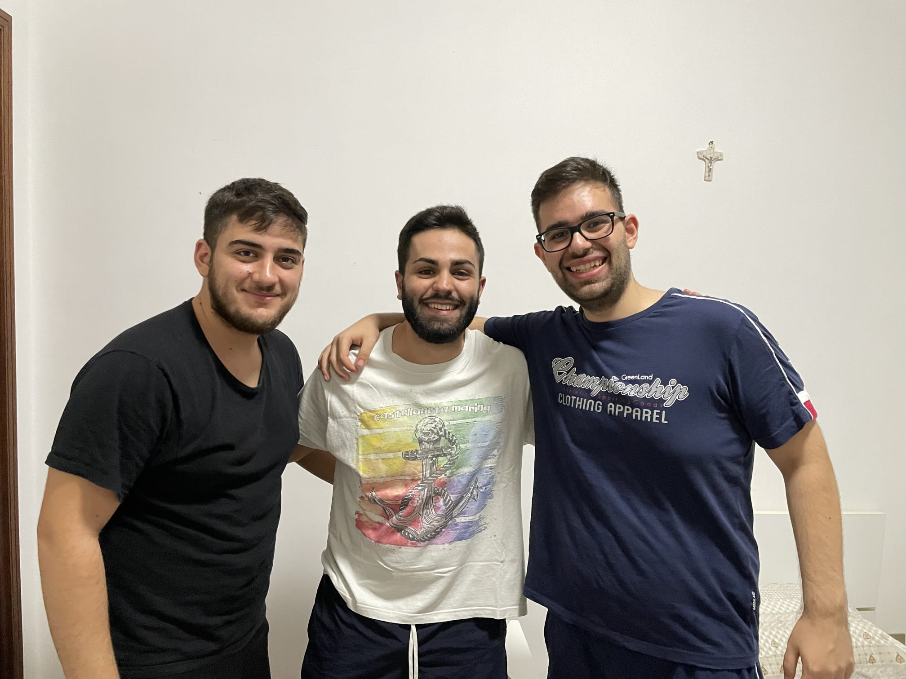
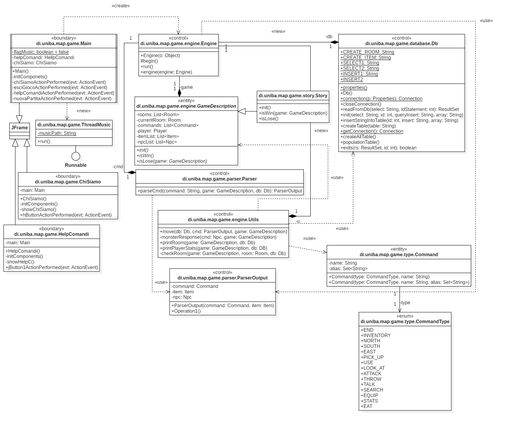
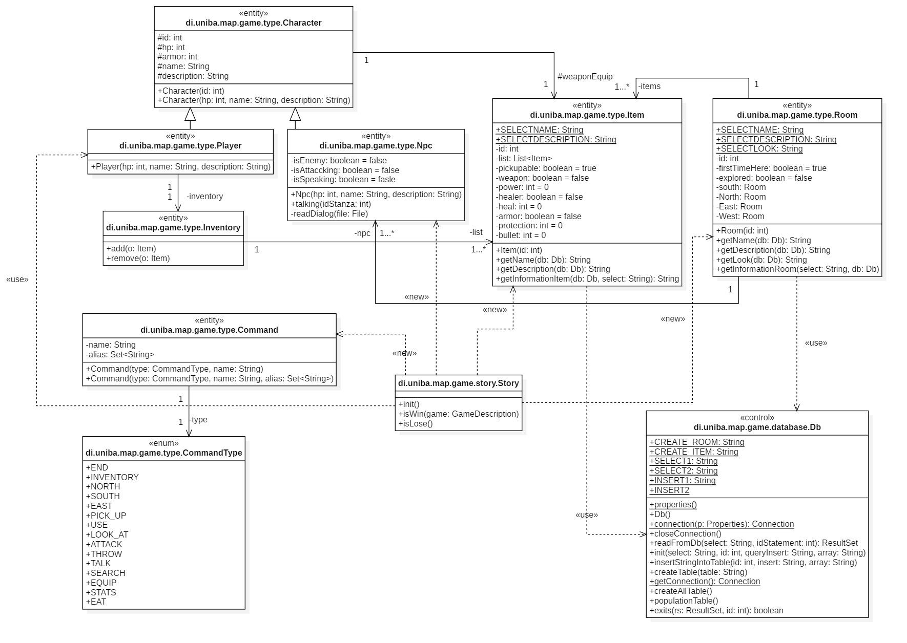

# Documentazione: caso d'uso
**Gli ingegneri:** 
1. *Nome:* Russo Giulio (mat.735338)
2. *Nome:* Scoglietti Francesco Pio (mat.735201)
3. *Nome:* Spicoli Piersilvio (mat.736519)

**Indice sul caso d'uso:**   
1. [Introduzione all'avventura testuale](#introduzione)
2. [Trama dell'avventura e ambientazione](#tramaeambientazione)
3. [Obbiettivi del gioco, regole e movimenti](#obbiettivi)  

**Indice sulla documentazione tecnica:**
1. [System Design](#systemdesign)
2. [OO Design](#oodesign)
3. [Dettagli implementativi](#dettagliimplementativi)

# Il Caso d'uso
## [**1. Introduzione all'avventura testuale**](#introduzione)
Gli Amari è un titolo che prende spunto da vari titoli videoludici e opere cinematografiche come: Mass Effect, Killzone e il film 1917. La storia è basata sul protagonista di nome Lello che insieme al suo gruppo noto come “Gli Amari” dovrà affrontare una minaccia aliena. Il gioco è ambientato ai giorni nostri e il giocatore avrà la possibilità di muoversi all’interno del gioco e interagire con vari personaggi.

## [**2. Trama dell'avventura e ambientazione**](#tramaeambientazione)
Bari, Lello è in procinto di partire per la guerra insieme al suo gruppo noto come “Gli Amari” formato da Lello, Frank, Giulio e Pier. Frank è un tipo molto riflessivo, responsabile ma con carisma e personalità. Pier è molto curioso tant’è che è in grado di porsi domande su qualsiasi cosa gli accada nella vita mentre Giulio, soprannominato spaccatutto, è dotato di forza e intelligenza. Il connubio perfetto. Tuttavia, ogni tanto è necessario che spacchi qualcosa. A Casa Amari è arrivata una “cartolina” che chiama alle armi chiunque sia in grado di combattere. Una minaccia aliena proveniente dallo spazio sta per attaccare. Navi nemiche chiamate razziatori hanno intenzione di fare piazza pulita del pianeta Terra. Queste navi seguono gli ordini di quella principale nota come “In Amber Clad”. Numerose intemperie aspettano i nostri amari...  
Il protagonista partendo da Casa Amari, potrà poi spostarsi all’interno della trincea. Da quest’ultima potremo poi spostarci in varie aree al suo interno per poi arrivare alla fine della trincea e al confronto con l’In Amber Clad, nave principale dell’invasione aliena.
## [**3. Obbiettivi del gioco, regole e movimenti**](#obbiettivi)
L’obiettivo del gioco è quello di distruggere la nave aliena nota come “In Amber Clad”, principale responsabile dell’invasione e riportare la pace sulla Terra. Per quanto riguarda i movimenti il giocatore avrà la possibilità di spostarsi in base a come ritiene opportuno farlo, limitatamente però ai limiti della mappa. I comandi principali per spostarsi sono NORD, SUD, EST, OVEST con le relative varianti sotto riportate. In generale i comandi principali sono rispettivamente:

Comando | Alias | Descrizione
------- | ----- | -----------
nord | n, N, Nord, NORD | Spostamento a nord
sud | s, S, Sud, SUD | Spostamento a sud
est | e, E, Est, EST | Spostamento a est
ovest | o, O, Ovest, OVEST | Spostamento a ovest
end | fine, esci, exit | Termina il gioco da console
raccogli | prendi, pick, prendere | Consente di raccogliere un oggetto
equipaggia | equip | Consente di equipaggiare degli oggetti o potenziamenti
parla | parla | Consente di parlare con un personaggio
attacca | attacca, combatti | Consente di attaccare un personaggio
usa | indossa, use, vesti | Consente di indossare un armatura
butta | getta, cestina, elimina, rimuovi | Consente di buttare un oggetto
inventario | inv, i, I | Consente di visualizzare l’inventario
osserva | guarda, vedi, descrivi | Consente di ottenere una descrizione precisa dell'ambiente
cerca | trova, controlla | Consente di cercare qualcosa nell’ambiente circostante
statistica | stat, stats, statistiche, vita, info, informazioni | Consente di ottenere statistiche sulla partita in corso
mangia | eat, bevi, assumi | Consente di mangiare o bere qualcosa  
  
# Documentazione tecnica
La realizzazione del caso d'uso è stata effettuata utilizzando il linguaggio di programmazione java e come tool di automazione per il controllo di versione Maven. 
Per una miglior esperienza del gameplay si consiglia di avviare il programma attraverso la console locale del vostro Pc. Quindi (per sistemi windows!):
1. Posizionarsi sulla cartella del progetto attraverso il comando `cd ~/nomeDirectoryProgetto`.
2. Listare i file e subdirectory presenti nlla cartella attraverso il comando `ls`.
3. Posizionarsi sulla cartella target attraverso il comando `cd target/`.
4. Digitare il comando `java -jar GliAmariAdventure-1.0-SNAPSHOT.jar`. 

Si tenga presente che è necessario scaricare l'ultima versione del progetto dal sito di github.

## [**1. System Design**](#systemdesign)
Per lo sviluppo del codice sono stati utilizzati 6 package:
1. `di.uniba.map.game`: contiene il codice che implementa il caso d'uso, tra cui la classe principale che consente l'avvio del programma e una classe che implementa il thread per la musica di sottofondo.
2. `di.uniba.map.game.engine`: contiene l'implementazione del motore di gioco, tra cui un modulo per la gestione dei comandi e un modulo per l'inizializzazione dell'avventura testuale.
3. `di.uniba.map.game.database`: contiene il modulo per la gestione del database.
4. `di.uniba.map.game.parser`: contiene il modulo per la gestione del parser.
5. `di.uniba.map.game.story`: contiene "la storia" della nostra avventura.
6. `di.uniba.map.game.type`: contiene i tipi di oggetti utilizzati nell'avventura, compresi i comandi.
7. `di.uniba.map.game.menu`: contiene i moduli per la gestione del menu principale all'avvio del programma.   

Tali scelte progettuali sono state prese in carico di comune accordo e per poter avere il giusto livello di modularità e di scalabilità durante le fasi di implementazione del caso.

## [**2. OO Design**](#oodesign)
Abbiamo pensato di dover dividere il nostro modello in due parti:
1. una prima vista che ci consente di visualizzare le classi che contengono i dettagli implementativi descritti in seguito (con relative motivazioni!).
2. una seconda vista che contiene il modello di dati utilizzati per poter rappresentare le entità scelte per l'avventura (descriveremo in questo paragrafo le scelte progettuali sulle classi).

Tali viste sono collegate fra loro: infatti, basti notare che nelle due viste sono presenti delle classi "ripetitive" proprio per poter far capire il collegamento che intercorre fra i modelli.

Utilizziamo la tassionomia ECB.

*vista uno*:

Nella prima vista, è possibile osservare che sono presenti classi di tipo Boundary (ossia la nostra interfaccia grafica) e le classi di tipo control (ossia le classi che elaborano i comandi e i servizi fra la parte front-end e la parte back-end). In generale:
1. `di.uniba.map.game.Main` è la classe principale che gestisce l'avvio del programma e delle sue componenti.
2. `di.uniba.map.game.game.ThreadMusic` è la classe che gestisce la musica di sottofondo.
3. `di.uniba.map.game.menu.ChiSiamo` è la classe che gestisce la finestra di informazioni sugli sviluppatori.
4. `di.uniba.map.game.menu.HelpComandi` è la classe che gestisce la finestra di informazioni sui comandi.
5. `di.uniba.map.game.engine.Engine` è la classe che gestisce il motore di gioco, l'avvio dell'avventura e prende in input i comandi del giocatore.
6. `di.uniba.map.game.engine.GameDescription` è una classe astratta nella quale vengono dichiarati tre metodi astratti, Iswin(), IsLose() e init(). IsWin() e IsLose() sono due metodi che ci consentono di definire le modalità di vittoria e sconfitta,  mentre init() che è il metodo di inizializzazione della nostra storia.
7. `di.uniba.map.game.engine.Utils` che viene usata per la gestione di tutti i comandi che possono essere usati dall’utente. Inoltre vengono effettuati tutti i controlli su questi comandi.
8. `di.uniba.map.game.parser.Parser` e `di.uniba.map.game.parser.ParserOutput` sono le classi che gestiscono il parser, che viene utilizzato per la gestione dei comandi. All'interno viene definito un'metodo che restituisce un oggetto di tipo ParserOutput che contiene i dati che il parser ha trovato.
9. `di.uniba.map.game.database.Db` è la classe che gestisce il database, che viene utilizzato per la gestione dei dati relativi alle relazioni di Oggetto e stanza.
10. `di.uniba.map.game.story.Story` è la classe che gestisce la storia dell'avventura. All’interno di questa classe vengono stabiliti tutti i comandi per giocare, vengono create tutte le stanze e vengono creati e inseriti all’interno di queste tutti gli oggetti e gli Npc. Infine, vengono gestiti la vittoria e la sconfitta del giocatore. 
11. `di.uniba.map.game.command.Command` e `di.uniba.map.game.command.CommandType` sono le classi che definiscono i comandi e i tipi di comandi.

*vista due*:

Nella seconda vista sono presenti classi entity e control. Le classi entity sono le classi che descrivono le nostre entità. In generale:

1. `di.uniba.map.game.type.Character` è la classe che definisce i personaggi e le loro caratteristiche come nome,descrizione e hp.
2. `di.uniba.map.game.type.Player` è la classe che gestisce tutte le caratteristiche del protagonista.
3. `di.uniba.map.game.type.Npc` è la classe che gestisce i personaggi con cui può interagire l'utente.
4. `di.uniba.map.game.type.Inventory` è la classe che gestisce la composizione dell'inventario del giocatore.
5. `di.uniba.map.game.type.Item` è la classe che gestisce le caratteristiche che un oggetto può avere.
6. `di.uniba.map.game.type.Room` è la classe che gestisce tutte le caratteristiche delle stanze.

## [**3. Dettagli implementativi**](#dettagliimplementativi)
**File**:
All’interno del progetto sono stati utilizzati i file di testo per quanto riguarda la lettura dei dialoghi con i personaggi e per la lettura all’interno del menu principale delle sezioni “ChiSiamo” e “HelpComandi”. In quanto tali classi estendono JFrame, abbiamo implementato un classico algoritmo per la lettura dei file, con la sola eccezione che il contenuto letto viene inserito nel campo di testo della finestra JTextPane presente.

**JSwing**: All’interno del progetto abbiamo implementato la java Swing per quanto riguarda il menù principale e le sue sezioni “helpComandi”, “ChiSiamo” e la finestra principale del gioco "Main". Per poter "abbellire" lo stile della grafica abbiamo utilizzato una libreria che imposta un *look and feel* per la grafica di ogni JFrame esteso: abbiamo scelto di utilizzare flatlaf-2.2.jar e aggiunto la dipendenza nel file pom.xml per poter utilizzare la libreria durante il programma.

**Database**: Nella nostra avventura testuale, l'implementazione del database è avvenuta mediante "H2", ovvero un gestore di basi di dati relazionale scritto in Java.
Sono state create due tabelle, una per quanto riguarda gli oggetti e una per quanto riguarda le stanze.

Per ogni stanza sono stati aggiunti i seguenti dati:
    - id, nome, descrizione e look;
Per ogni oggetto sono stati aggiunti i seguenti dati:
    -id,nome e descrizione;

E' stata creata una classe responsabile della creazione e del popolamento delle tabelle. Quindi sono state scritte delle query. Una per quanto riguarda la creazione delle tabelle, una per quanto riguarda la ricerca di un dato all'interno della tabelle e una query per quanto riguarda la popolazione delle tabelle.

In quanto per scelte progettuali memorizziamo i dati relativi alle stanze e agli oggetti presenti nell'avventura, nelle classi rispettive vengono definite delle operazioni che ci consentono di andare a richiamare il contenuto specificato nel Db. Per fare ciò abbiamo modificato il costruttore delle rispettive classi in modo da poter specificare durante l'inizializzazione di tali oggetti (tale inizializzazione avviene nel metodo init()) il valore Id della tupla a cui essa è associata. Inoltre, in queste classi è presente un'operazione, che presi in input la query di selezione e il database da cui vogliamo andare a prelevare i nostri dati, restituisce una stringa che corrisponde esattamente alla tupla specificata.

**Thread**:
spiegare come facciamo sta cosa e come viene lanciata

